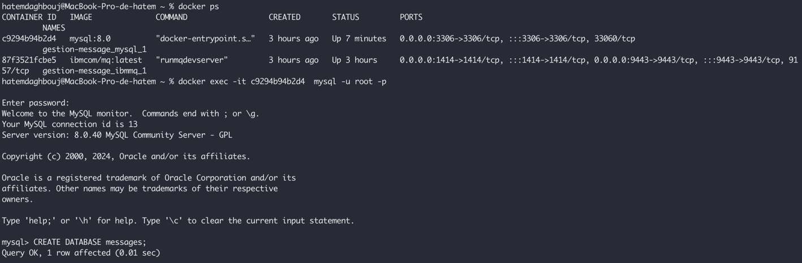

# Coding Test

Cette application a été réalisé pour répondre à un test technique.

Vous pouvez éxécuter l'application en tappant `docker-compose up --build`. Ce qui permet de lancer: 
 
- L'application Backend : [http://localhost:8081/](http://localhost:8081/)
- L'application Frontend : [http://localhost:8080/](http://localhost:8080/)
- Container de base de données sql : usilise l'image `mysql`.
- Container d'`IBM MQ` : Vous pouvez accéder à l' via ce lien : [https://localhost:9443/ibmmq/console/login.html](https://localhost:9443/ibmmq/console/login.html)

## Installation:
1. Exécuter `docker-compose up --build` dans le but de builder le projet.
2. Si vous avez un problème de connexion avec MySQL, pensez plutôt à créer votre base de données nommé `messages` comme il est indiqué dans le catupre suivante:

3. Accéder au IHM via ce lien[http://localhost:8080/](http://localhost:8080/)

## Screenshot of the project:

1. List Partner view: cette vue contient la gestion des partenaires (en utilisant le `server silde pagination`). Aussi,
  dans cette vue vous pouvez supprimer un partenaire:

2. Add Partner view: Cette vue permet d'ajouter un partenaire:

3. List messages view: Cette vue permet de voir les messages sous la forme d'une liste (en utilisant le `server silde pagination`). Aussi,
   dans cette vue vous pouvez afficher un popup pour voir les détails d'un message en particulier en cliquant sur la colonne `content`:

## Context: 
Le département de paiement de la banque est amené à recevoir des messages de la part des applications Back Office via une file `IBM MQ` Series.
Ces messages vont transiter dans une application de routage pour être transférés vers d’autres destinations.
Les utilisateurs ont aussi la possibilité d’ajouter des partenaires pour configurer les MQ.

## A réaliser: 

Créer une application qui permet :

- De lire et de stocker les messages déposés sur une file `IBM MQ` Series dans une base de données relationnelle.
- D’afficher la liste des messages stockés dans l’IHM sous forme de tableau.
- Pouvoir afficher le détails d’un message quand l’utilisateur clique sur le message dans le tableau.
Le détail s’affiche sous forme de popup avec un bouton `cancel` pour fermer la popup.
- D’exposer des API REST pour la consultation des messages via une IHM.
- D’exposer une API REST pour ajouter des partenaires. Pour ajouter un partenaire il faut les informations suivantes:
  - Alias:  required
  - Type: required
  - Direction:  deux possibilités `INBOUND, OUTBOUND`
  - Application: champ texte libre
  - Processed Flow Type 3 possibilités `MESSAGE, ALERTING, NOTIFICATION`
  - Description: required
- D’ajouter et de supprimer des partenaires MQ côté IHM
- Côté IHM l’utilisateur a menu de navigation qui contient Messages pour afficher la liste des messages, Partenaires pour accéder à la liste de partenaire et de pouvoir ajouter des partenaires. La liste des partenaires est un tableau aussi avec les propriétés comme nom de colonne.

Cette application devrait répondre à des contraintes de performance et de résilience étant donnée la volumétrie importante de messages à traiter.

#### Environnement technique:

- Langage: Java 11+
- Framework Spring Boot 2+
- Framework Angular 17, Angular Material ou autre comme couche graphique.
- Base de données relationnelle : aucune préférence
- Projet Maven
- Documentation pour tester l’application
- Utilisation de docker si possible
- Pusher le code sur github

#### Out Of Scope:

Gestion de l’authentification et des autorisations.

### Rappel: 

Pour lancer le build des images Docker, vous avez deux options, soit on utilisant un cache build ou pas : 

`docker-compose up --build`  # still use image cache

Ou bien

`docker-compose build --no-cache`  # never use cache

==> Cette commande : `docker-compose up --build --force-recreate` permet de forcer la recréation des images Docker  en vidant le cache (`docker system prune`).

==> Cette commande : `docker-compose build --no-cache <service>` permet de forcer la recréation d'un image docker pour **un service** bien spécifique.

### Contact: 
You can contact me : [dagboujhatem@gmail.com](mailto:dagboujhatem@gmail.com)
